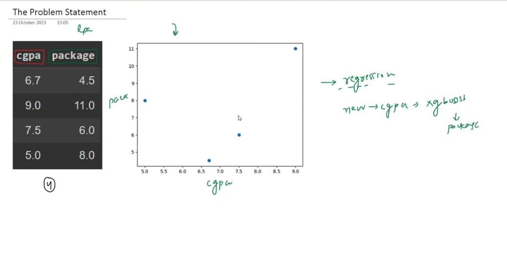
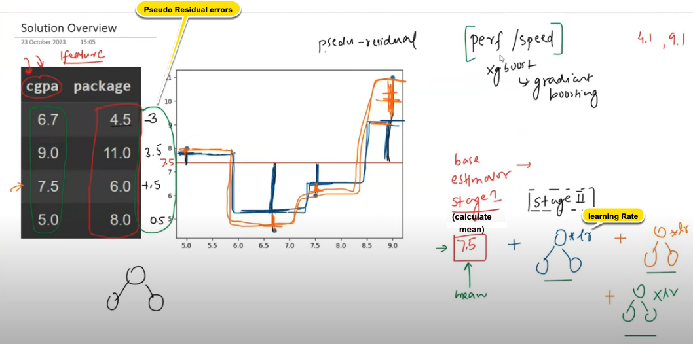

## 🧠 **Big Picture: What’s happening here?**

<figure>
  
  <figcaption><b>Fig 1:</b> Dataset</figcaption>
</figure>

This image is illustrating how **XGBoost (Extreme Gradient Boosting)** works for **regression tasks**, using a very simple dataset of CGPA vs Salary Package to demonstrate how models are built stage-by-stage.

---

## 🎯 **Problem Setup**

You have a tiny dataset:

| CGPA  | Package (LPA) |
|-------|----------------|
| 6.7   | 4.5            |
| 9.0   | 11.0           |
| 7.5   | 6.0            |
| 5.0   | 8.0            |

We want to **predict “Package”** based on **CGPA**, using **XGBoost Regression**.

---

## 🔄 Step-by-step Explanation of the Image

<figure>
  
  <figcaption><b>Fig 2:</b> How XGBoost works for Regression Tasks</figcaption>
</figure>


### 🧩 Step 1: Base Model — Predict the Mean
- You start with a very **simple base model**: predict the **mean of all output values** (i.e., all packages).
- From the dataset:
  \[
  \text{Mean} = \frac{4.5 + 11.0 + 6.0 + 8.0}{4} = 7.5
  \]
- This is shown in red (middle of the y-axis).

➡️ Everyone’s predicted package is **7.5**, regardless of CGPA.
✅ **This is the Stage-1 prediction.**

---

### ⚠️ Step 2: Calculate Errors (Pseudo Residuals)
- Now, calculate how far this prediction is from actual values. These are called **pseudo-residuals** (like temporary errors).

| CGPA | Actual Package | Prediction | Residual (Error) |
|------|----------------|------------|------------------|
| 6.7  | 4.5            | 7.5        | -3.0             |
| 9.0  | 11.0           | 7.5        | +3.5             |
| 7.5  | 6.0            | 7.5        | -1.5             |
| 5.0  | 8.0            | 7.5        | +0.5             |

➡️ These residuals are plotted on the graph — notice **Y-axis range is error**, not package.

---

### 🌳 Step 3: Fit a Decision Tree on Residuals
- Now build a small decision tree (**stage 2 model**) to **predict the residuals** based on CGPA.
- The idea is:
  > Instead of predicting the final package directly, **fit a tree to learn the errors of the last model.**

That’s what’s drawn:
- The orange curve (new prediction of residuals)
- The blue curve (combined model: base + first residual prediction)

---

### ➕ Step 4: Update Predictions
- Final prediction =
  \[
  \text{Stage-1 output (mean)} + \eta \times \text{Stage-2 output}
  \]
  where \(\eta\) = **learning rate** (often 0.3 or 0.1)

🔖 This is shown as:
```plaintext
final_model = mean + η * output_of_tree1
```
⬅️ This is marked as `learningRate` on the image.

---

### 🔁 Step 5: Repeat the Process
- Calculate new residuals (errors between prediction and actual)
- Fit another decision tree to those residuals
- Keep adding corrections
- The curve slowly improves → closer fit to actual data

This is the **blue + orange lines building up over time**.

---

## 📌 Summary of Key Labels in the Image

| Label on Image | What it Means |
|----------------|---------------|
| `cgpa → package` | Your input feature and output |
| `mean = 7.5` | Stage-1 prediction (just average) |
| `pseudo residual` | Temporary errors between prediction and actual |
| Tree diagrams (bottom) | Each new decision tree learns to fix the previous error |
| `learningRate` | Controls how much correction from each tree is added |
| `[perf/speed] xgboost vs gradient boosting` | XGBoost = optimized version of gradient boosting |
| Rightmost values (4.1, 9.1) | New unseen inputs (e.g., new CGPA) for prediction |

---

## ✅ Interpretation: Why is this smart?

Instead of trying to model the complex CGPA→Package mapping directly, XGBoost **learns in stages**:
- Stage 1: Guess a baseline (mean)
- Stage 2: Learn to fix the error from stage 1
- Stage 3: Learn to fix remaining error
- ...
- Until the model becomes a very **accurate ensemble** of simple trees.

📈 It’s like **incrementally improving your guess** with each stage.

---

If you'd like, I can generate a Colab notebook version of this with all code and visuals preloaded. Want that?