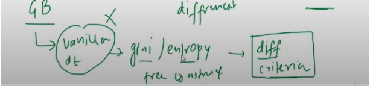

## 📘 Gradient Boosting vs XGBoost Trees

src: https://youtu.be/gmp2tS2joaA?t=632

---

<figure>
  
  <figcaption><b>Fig 4:</b> Tree Building in GB vs XGB</figcaption>
</figure>

The above image **clearly compares** the tree-building logic used in:

- ✅ **Gradient Boosting (GB)**
- ✅ **XGBoost (XGB)**

Let’s break it down step by step using the diagram and your transcript:

---


### 🟩 Left Side: Traditional Gradient Boosting (GB)

#### 🧱 **Uses "Vanilla" Decision Trees**
- The term **vanilla dt** means **basic decision trees**, like those built using `sklearn.tree.DecisionTreeRegressor` or `Classifier`.

#### ⚖️ **Splitting Criteria**
- These trees use **Gini Index** or **Entropy** (for classification), and **MSE** (for regression) to determine the best split.
- That’s what the image shows:
  ```text
  gini / entropy → tree construct
  ```

#### ✖️ **Limitations**

- Marked with a ❌ in the image: traditional trees don't take into account **second-order information** (like Hessians).
- No regularization, no advanced optimization.

---

### 🟦 Right Side: XGBoost (XGB)

#### 🔁 **Different Tree Construction**
- XGBoost uses a **different criteria** entirely for building trees:
  - It uses a **custom objective function**.
  - It includes both **first-order (gradient)** and **second-order (Hessian)** information.
  - It computes a **similarity score** to evaluate splits — this helps it choose splits that **maximize gain**.

#### 🧠 **What’s “Different” in XGBoost?**

- ✅ Regularization (to avoid overfitting)
- ✅ Weighted leaf scores
- ✅ Advanced gain-based splitting
- ✅ Efficient split-finding (Exact or Approximate algorithms)

This is what the image captures with:
```text
diff criteria → tree construction
```

---

## 🧩 Summary Table: GB vs XGBoost

| Feature                    | Gradient Boosting (GB)          | XGBoost (XGB)                          |
|---------------------------|----------------------------------|----------------------------------------|
| Tree Type                 | Vanilla DT                      | Special optimized DT                   |
| Splitting Criteria        | Gini, Entropy (Classification) <br> MSE (Regression) | Gain based on Gradient + Hessian |
| Regularization            | ❌ No                           | ✅ Yes (L1, L2)                         |
| Objective Function        | Predefined                      | Custom & Differentiable                |
| Speed Optimization        | Basic                           | Highly optimized                       |
| Memory Optimization       | ❌                              | ✅ Column block & pruning              |

---

### 💡 In short:

> Gradient Boosting uses standard decision trees, but **XGBoost builds trees using advanced optimization**, regularization, and **a different tree-building algorithm** — making it faster and more accurate, especially on large or complex datasets.

