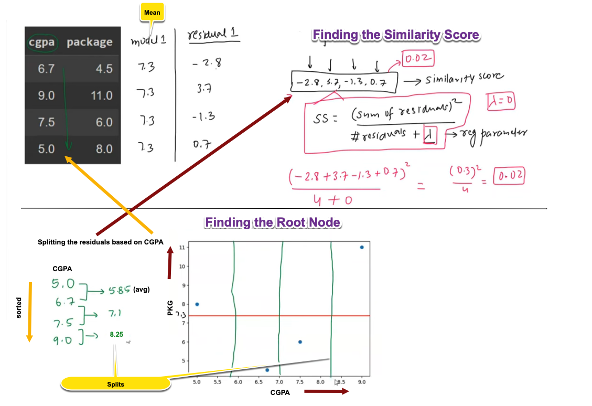

## 🧠 XGBoost Regression – How it Works (Step-by-Step Breakdown)

<figure>
  
  <figcaption><b>Fig 1:</b> Initial stages of how XGBoost solves a regression problem</figcaption>
</figure>

This diagram illustrates the **initial stages of how XGBoost solves a regression problem** using decision trees in a stage-wise manner.

---

### ✅ Step 1: Dataset and the First Model

🔶 **Top-left of the diagram:**
We are given a **simple dataset** of students:

| CGPA | Package (LPA) |
|------|----------------|
| 6.7  | 4.5            |
| 9.0  | 11.0           |
| 7.5  | 6.0            |
| 5.0  | 8.0            |

📌 Our **goal** is to **predict package** using CGPA as input.

---

### ✅ Step 2: Base Estimator (Mean Model)

🟡 The yellow **"Mean"** tag shows we begin with a **base prediction model**, which just predicts the **mean of the output values**:

\[
\text{Mean} = \frac{4.5 + 11 + 6 + 8}{4} = 7.3
\]

Thus, our first model (`model 1`) predicts **7.3 for all students**, regardless of their CGPA.

---

### ✅ Step 3: Calculate Residuals (Errors)

🎯 We compute the **difference** between actual and predicted values:

| CGPA | Actual | Predicted | Residual |
|------|--------|-----------|----------|
| 6.7  | 4.5    | 7.3       | -2.8     |
| 9.0  | 11.0   | 7.3       | +3.7     |
| 7.5  | 6.0    | 7.3       | -1.3     |
| 5.0  | 8.0    | 7.3       | +0.7     |

These **residuals** form the new "target values" to be predicted in the next stage.

---

### ✅ Step 4: Calculate Similarity Score (SS)

🟥 The formula highlighted in red:

\[
SS = \frac{(\sum \text{residuals})^2}{n + \lambda}
\]

Where:
- \( \lambda \) is the regularization parameter (here, assumed 0),
- Residuals are: -2.8, +3.7, -1.3, +0.7

So:

\[
\text{Sum} = -2.8 + 3.7 - 1.3 + 0.7 = 0.3
\quad \Rightarrow \quad SS = \frac{(0.3)^2}{4} = 0.02
\]

🧠 This tells us **how similar the residuals are** — higher SS = more similar.

---

### ✅ Step 5: Finding the Best Split (Root Node of Tree)

📉 **We beginning by calculating possible split points**

To build the **first decision tree**, we must split the dataset. The tree uses the **CGPA** column to divide the data and predict residuals.

🟢 First, we **sort** the CGPA values:

\[
5.0, 6.7, 7.5, 9.0
\]

We consider **midpoints between each pair** for **possible** **splits**:

- Between 5.0 & 6.7: (5.0 + 6.7)/2 = 5.85
- Between 6.7 & 7.5: (6.7 + 7.5)/2 = 7.1
- Between 7.5 & 9.0: (7.5 + 9.0)/2 = 8.25

These are shown in **yellow callouts** labeled `Splits`. These are the possible split points.

---

### ✅ Step 6: Visualizing Splits on the Graph

📊 In the scatter plot:
- **X-axis** is CGPA
- **Y-axis** is Package
- Vertical green lines represent **potential splits**
- The horizontal red line is the **initial mean prediction**

We will evaluate each split to see **which gives the best gain** in similarity score. The one that gives the **highest gain** becomes the **root node of the tree**.

---

### 🔁 What Happens Next?

Once the best split is selected:
- The dataset is divided into 2 groups (left and right leaves)
- For each group, we calculate **new similarity scores**
- This helps us build the decision tree that best predicts the residuals.

Then:
- The output of the tree is multiplied by a **learning rate (e.g., 0.3)** and **added** to the mean model.

---

## 🔚 Summary (in Beginner Terms)

| Step | What’s Happening? | Purpose |
|------|-------------------|---------|
| 1️⃣   | Predict mean (7.3) for all data | Get a starting model |
| 2️⃣   | Compute residuals | Understand model error |
| 3️⃣   | Build a tree to predict residuals | Correct the errors |
| 4️⃣   | Use CGPA to split data | Build decision rules |
| 5️⃣   | Compute gain from splits | Pick best split (root node) |
| 6️⃣   | Repeat process | Improve predictions iteratively |

