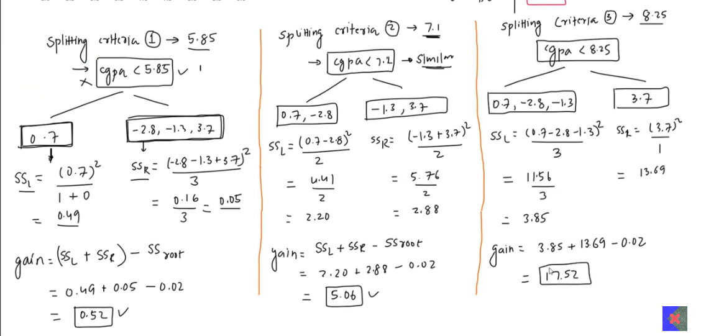
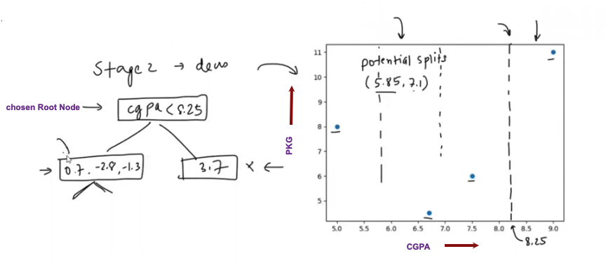
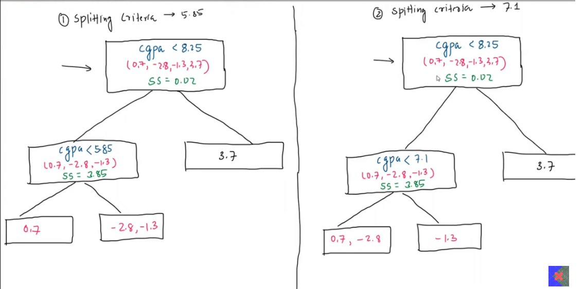
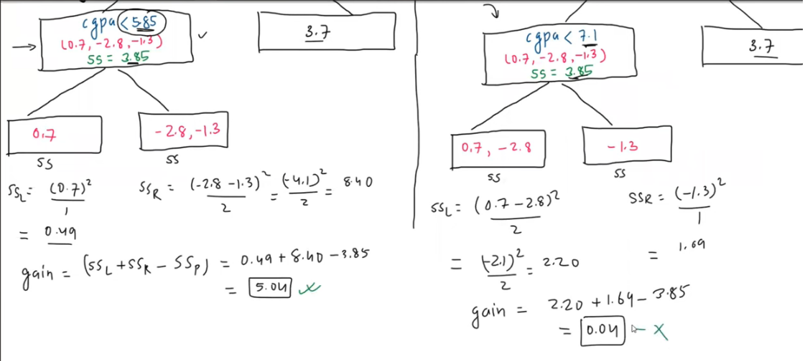
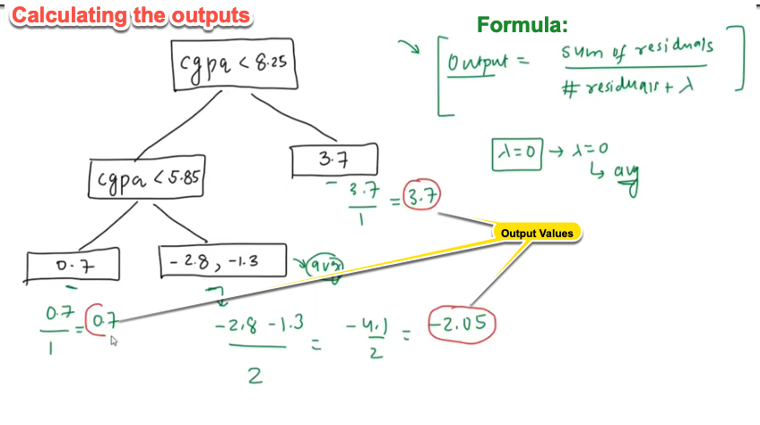
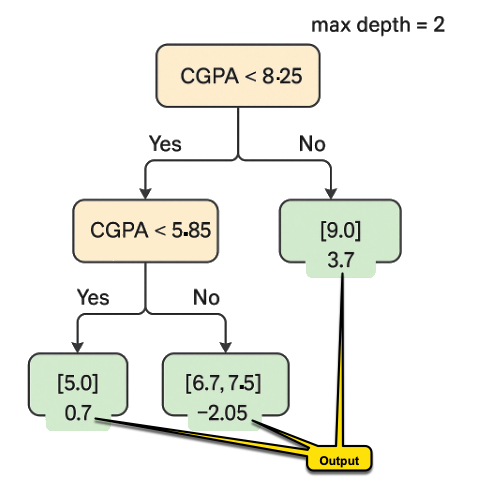
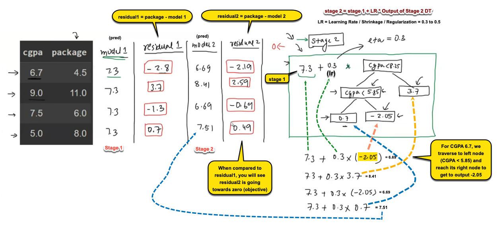

Let's expand this part of the discussion and **calculate the similarity gain step by step** for each of the three possible splits: **5.85, 7.1, and 8.25**.

---

## 🧾 Dataset

| CGPA | Package | Model 1 Prediction (Mean) | Residual |
|------|---------|----------------------------|----------|
| 6.7  | 4.5     | 7.3                        | -2.8     |
| 9.0  | 11.0    | 7.3                        | +3.7     |
| 7.5  | 6.0     | 7.3                        | -1.3     |
| 5.0  | 8.0     | 7.3                        | +0.7     |

---

## 🔍 Goal: Find the Best Split Based on Similarity Gain

There are three possible splits: **5.85, 7.1, and 8.25**
[See Step 5: Finding the Best Split (Root Node of Tree)](./2_4-XGBoost%20Regression%20–%20How%20it%20Works%20(Step-by-Step%20Breakdown).md)

---

<figure>
  
  <figcaption><b>Fig 2:</b> Finding the best split</figcaption>
</figure>

### 📌 Similarity Score Formula (SS)

\[
SS = \frac{(\sum \text{residuals})^2}{\text{number of residuals} + \lambda}
\]
- We'll assume \( \lambda = 0 \) for now (no regularization).
- Our objective is to **maximize the gain**:

\[
\text{Gain} = SS_{\text{left}} + SS_{\text{right}} - SS_{\text{root}}
\]

### 🧮 Step 1: Compute Root Node Similarity Score (before any split)

All 4 residuals in one group: `[-2.8, 3.7, -1.3, 0.7]`

\[
\text{Sum} = -2.8 + 3.7 - 1.3 + 0.7 = 0.3
\]
\[
SS_{\text{root}} = \frac{(0.3)^2}{4} = \frac{0.09}{4} = 0.0225
\]

---

## 🟨 Step 2: Try Split at 5.85

### 🔀 Grouping:

- Left (CGPA < 5.85): [CGPA = 5.0] → Residuals: [0.7]
- Right (CGPA ≥ 5.85): [CGPA = 6.7, 7.5, 9.0] → Residuals: [-2.8, -1.3, 3.7]

---

### 🧮 Left Node Similarity

\[
\text{Sum} = 0.7,\quad SS_{\text{left}} = \frac{(0.7)^2}{1} = \frac{0.49}{1} = 0.49
\]

### 🧮 Right Node Similarity

\[
\text{Sum} = -2.8 -1.3 + 3.7 = -0.4
\]
\[
SS_{\text{right}} = \frac{(-0.4)^2}{3} = \frac{0.16}{3} \approx 0.0533
\]

### 🧮 Gain

\[
\text{Gain}_{5.85} = 0.49 + 0.0533 - 0.0225 = 0.5208
\]

---

## 🟩 Step 3: Try Split at 7.1

### 🔀 Grouping:
- Left (CGPA < 7.1): [5.0, 6.7] → Residuals: [0.7, -2.8]
- Right (CGPA ≥ 7.1): [7.5, 9.0] → Residuals: [-1.3, 3.7]

---

### 🧮 Left Node

\[
\text{Sum} = 0.7 - 2.8 = -2.1,\quad SS = \frac{(-2.1)^2}{2} = \frac{4.41}{2} = 2.205
\]

### 🧮 Right Node

\[
\text{Sum} = -1.3 + 3.7 = 2.4,\quad SS = \frac{(2.4)^2}{2} = \frac{5.76}{2} = 2.88
\]

### 🧮 Gain

\[
\text{Gain}_{7.1} = 2.205 + 2.88 - 0.0225 = 5.0625
\]

✅ **This gain is better than at 5.85!**

---

## 🟦 Step 4: Try Split at 8.25

### 🔀 Grouping:
- Left (CGPA < 8.25): [5.0, 6.7, 7.5] → Residuals: [0.7, -2.8, -1.3]
- Right (CGPA ≥ 8.25): [9.0] → Residual: [3.7]

---

### 🧮 Left Node

\[
\text{Sum} = 0.7 - 2.8 - 1.3 = -3.4,\quad SS = \frac{(-3.4)^2}{3} = \frac{11.56}{3} \approx 3.85
\]

### 🧮 Right Node

\[
\text{Sum} = 3.7,\quad SS = \frac{(3.7)^2}{1} = 13.69 / 1 = 13.69
\]

### 🧮 Gain

\[
\text{Gain}_{8.25} = 3.85 + 13.69 - 0.0225 = 17.5175
\]

✅✅✅ **This is the highest gain. So this split is the best!**

---

## ✅ Final Decision: Pick the Best Split

| Split Point | Gain      |
|-------------|-----------|
| 5.85        | 0.5208    |
| 7.1         | 5.0625    |
| 8.25        | 17.5175 ✅ |

---

## 🌳 Therefore:
- The best split is at **CGPA < 8.25**
- This becomes the **root node** of the decision tree
- It results in one side with three samples and one with just one (3.7)

---

### 📌 After First Split at 8.25

Let's **continue building the full decision tree**, picking up from our best first split:
> **Root node: `CGPA < 8.25`**, because this gave the **highest similarity gain (17.52)**

---

<figure>
  
  <figcaption><b>Fig 3:</b> Stage 2</figcaption>
</figure>

---

| Branch        | Residuals            | CGPA Values    |
|---------------|----------------------|----------------|
| **Left Node** | [0.7, -2.8, -1.3]    | [5.0, 6.7, 7.5] |
| **Right Node**| [3.7]                | [9.0]          |

- Right node has only one residual → cannot be split further.
- We will now try **splitting the left node** at its remaining CGPA values.

---

## 🔄 Step 5: Further Split Left Node [0.7, -2.8, -1.3]

<figure>
  
  <figcaption><b>Fig 4:</b> Stage 2 (contd) </figcaption>
</figure>


### 💡 Possible Split Points:
The CGPA values in this node are: **5.0, 6.7, 7.5**

Sorted → [5.0, 6.7, 7.5]
So possible splits (midpoints) are:
- 5.85 (between 5.0 and 6.7)
- 7.1 (between 6.7 and 7.5)

---

## 🟨 Try Split at 5.85

### 🔀 Grouping:
- Left: CGPA < 5.85 → [5.0] → Residuals: [0.7]
- Right: [6.7, 7.5] → Residuals: [-2.8, -1.3]

---

### 🧮 Similarity Scores

**Left:**

\[
SS_{\text{left}} = \frac{(0.7)^2}{1} = 0.49
\]

**Right:**

\[
\text{Sum} = -2.8 -1.3 = -4.1,\quad SS = \frac{(-4.1)^2}{2} = \frac{16.81}{2} = 8.405
\]

**Parent Node (before split):**

\[
\text{Sum} = 0.7 - 2.8 - 1.3 = -3.4,\quad SS_{\text{parent}} = \frac{(-3.4)^2}{3} = \frac{11.56}{3} \approx 3.85
\]

**Gain:**

\[
\text{Gain}_{5.85} = 0.49 + 8.405 - 3.85 = 5.045
\]

---

## 🟩 Try Split at 7.1

### 🔀 Grouping:
- Left: CGPA < 7.1 → [5.0, 6.7] → Residuals: [0.7, -2.8]
- Right: [7.5] → Residual: [-1.3]

---

### 🧮 Similarity Scores

**Left:**

\[
\text{Sum} = 0.7 - 2.8 = -2.1,\quad SS = \frac{(-2.1)^2}{2} = \frac{4.41}{2} = 2.205
\]

**Right:**

\[
SS = \frac{(-1.3)^2}{1} = 1.69
\]

**Gain:**

\[
\text{Gain}_{7.1} = 2.205 + 1.69 - 3.85 = 0.045
\]

---

## ✅ Final Choice for Left Node:

<figure>
  
  <figcaption><b>Fig 6:</b> Gain at Left Node </figcaption>
</figure>

| Split | Gain     |
|-------|----------|
| 5.85  | 5.045 ✅ |
| 7.1   | 0.045    |

So we split again at `CGPA < 5.85`.

---

## 🌳 Final Tree Structure (max depth = 2):

```plaintext
Root: CGPA < 8.25
├── Right Leaf: [9.0] → Residual = 3.7
└── Left: CGPA < 5.85
    ├── Left Leaf: [5.0] → Residual = 0.7
    └── Right Leaf: [6.7, 7.5] → Residuals = [-2.8, -1.3]
```

---

## 🧮 Final Step: Compute Leaf Outputs

<figure>
  
  <figcaption><b>Fig 7:</b> Outputs </figcaption>
</figure>

> In **XGBoost regression**, once a decision tree is built, each **leaf node** outputs a value. This value is used to update the prediction. The **formula to calculate the output of a leaf node** is slightly different from a vanilla decision tree (which uses average or majority):
>
> ---
>
> ### ✅ **Formula to compute the output of a leaf node in XGBoost**:
>
> \[
> \text{Output} = \frac{\sum_i g_i}{\sum_i h_i + \lambda}
> \]
>
> ---
>
> ### 🔍 But what is \( g_i \), \( h_i \), and \( \lambda \)?
>
> | Symbol     | Meaning |
> |------------|---------|
> | \( g_i \)  | First-order gradient (a.k.a. residual) for instance \( i \) |
> | \( h_i \)  | Second-order gradient (i.e., the Hessian; in squared error loss, this is just 1) |
> | \( \lambda \) | Regularization parameter to prevent overfitting |
>
> ---
>
> ### 🧠 In our simplified regression case (with squared error loss):
> - \( g_i = \text{residual}_i = y_i - \hat{y}_i \)
> - \( h_i = 1 \) (since the second derivative of squared error is constant)
> - So the formula becomes:
>
> \[
> \text{Output} = \frac{\sum \text{residuals}}{\text{number of residuals} + \lambda}
> \]
>
> ---
>
> ### 🧮 Example (from your dataset):
>
> Let’s say the residuals in a leaf node are:
>
> ```
> residuals = [-2.8, -1.3]
> lambda = 0
> ```
>
> Then,
>
> \[
> \text{Output} = \frac{-2.8 + (-1.3)}{2 + 0} = \frac{-4.1}{2} = -2.05
> \]
>
> ---
>
> ### 📌 Summary:
>
> | Term | Description |
> |------|-------------|
> | Leaf Output | Average of residuals if \( \lambda = 0 \) |
> | Regularization | \( \lambda \) adds a penalty to prevent large outputs |
> | Used in | Updating prediction: \( \hat{y}_{new} = \hat{y}_{old} + \eta \cdot \text{Output} \), where \( \eta \) is learning rate |

---

Leaf values (used in predictions) = average of residuals in that leaf:

| Leaf CGPA Values        | Residuals         | Output (avg)         |
|-------------------------|-------------------|-----------------------|
| [9.0]                   | [3.7]             | **3.7**               |
| [5.0]                   | [0.7]             | **0.7**               |
| [6.7, 7.5]              | [-2.8, -1.3]      | \((-4.1)/2 = -2.05\)  |

---

### Stage 1 Decision Tree (Model 2)

<figure>
  
  <figcaption><b>Fig 11:</b> Stage 1 Tree</figcaption>
</figure>

---

## ✅ Next Prediction Formula (Stage 2 Model)

<figure>
  
  <figcaption><b>Fig 12:</b> Developing Stage 2 Model</figcaption>
</figure>

This is a **Stage 2 update** in Gradient Boosting, where predictions are incrementally improved.

---

## 🧩 **Overview of What’s Happening**

We're solving a regression problem using XGBoost, where:
- 🎯 The goal is to predict the **package (LPA)** based on **CGPA**.
- We're using **Gradient Boosting**, which starts with a base model (mean) and **adds decision trees stage by stage** to reduce error (residuals).

---

### ✅ **Step 1: The Original Dataset**

| CGPA | Package (Target) |
|------|------------------|
| 6.7  | 4.5              |
| 9.0  | 11.0             |
| 7.5  | 6.0              |
| 5.0  | 8.0              |

---

### ✅ **Step 2: Model 1 - Start with Mean Prediction**

- The first prediction for all samples is just the **mean of the package** values:
  \[
  \text{Mean} = \frac{4.5 + 11 + 6 + 8}{4} = 7.3
  \]
- So, **Model 1 Output = 7.3 for all rows**

---

### ✅ **Step 3: Residual 1 Calculation**

\[
\text{Residual 1} = \text{Package} - \text{Model 1 Prediction}
\]

| CGPA | Package | Model 1 | Residual 1 |
|------|---------|---------|------------|
| 6.7  | 4.5     | 7.3     | 4.5 - 7.3 = **-2.8** |
| 9.0  | 11.0    | 7.3     | 11 - 7.3 = **3.7** |
| 7.5  | 6.0     | 7.3     | 6 - 7.3 = **-1.3** |
| 5.0  | 8.0     | 7.3     | 8 - 7.3 = **0.7**  |

---

### ✅ **Step 4: Stage 2 - Build Tree to Predict Residuals**
A **decision tree** is trained to predict these residuals based on CGPA values. The structure of the tree is shown on the **right side** of the image.

The **tree logic** is:
- If CGPA < 8.25 → go left
  - If CGPA < 5.85 → leaf output = 0.7
  - Else → leaf output = -2.05
- Else (CGPA ≥ 8.25) → leaf output = 3.7

---

### ✅ **Step 5: Model 2 = Model 1 + (learning rate × Tree Output)**

The learning rate is \( \eta = 0.3 \).

> ### 🧠 **Rationale for Choosing a Learning Rate of η = 0.3 in XGBoost**
>
> ---
>
> ### 🔍 What is the Learning Rate (η)?
> In **Gradient Boosting (including XGBoost)**, the learning rate (also called **shrinkage**) controls **how much each new tree contributes** to the overall model.
>
> The formula looks like this:
> \[
> \text{Model}_{t+1} = \text{Model}_t + \eta \times \text{Tree}_t
> \]
>
> ---
>
> ### ⚙️ Why Use a Learning Rate?
>
> Using a **small η**:
> - ✔️ Prevents overfitting by **slowing down learning**
> - ✔️ Allows the model to **correct itself gradually**
> - 🚫 Needs **more trees** to converge
>
> Using a **large η**:
> - ✔️ Speeds up convergence
> - 🚫 Increases the risk of **overshooting** the optimal solution (overfitting)
>
> ---
>
> ### 🟨 Why η = 0.3 Specifically?
>
> XGBoost's default learning rate is:
> ```python
> learning_rate = 0.3
> ```
>
> This value:
> - ✅ Is empirically found to perform well in many real-world datasets
> - ✅ Strikes a **balance** between speed and accuracy
> - ✅ Is **large enough** to make progress
> - ✅ Is **small enough** to allow many trees to refine predictions
>
> ---
>
> ### 📊 Rule of Thumb
> | Learning Rate (η) | Trees Required | Overfitting Risk | Use Case |
> |--------------------|----------------|------------------|----------|
> | **0.1 – 0.3**      | Moderate       | Low to Moderate  | ✅ Default; good tradeoff |
> | **< 0.1**          | High           | Very Low         | For very large datasets |
> | **> 0.3**          | Few            | High             | Fast training, risky |
>
> ---
>
> ### 📌 In Summary:
> **η = 0.3** is used in this example because:
> - It's the **default in XGBoost**
> - It provides **visible improvement in each boosting stage**
> - It's **easy to explain visually** in learning demos
> - You need **fewer trees**, which is ideal for small datasets or teaching purposes
>
> ---
>
> Would you like to experiment by comparing results when η = 0.1 or η = 0.5 using the same dataset and tree logic?
>

We now use the tree predictions and **update Model 1**:

\[
\text{Model 2 Output} = 7.3 + 0.3 \times \text{Tree Prediction}
\]

Let’s compute this for each row:

| CGPA | Tree Output | Model 2 = 7.3 + 0.3×Tree | Residual 2 = Package - Model 2 |
|------|-------------|--------------------------|-------------------------------|
| 6.7  | -2.05       | 7.3 + 0.3×(-2.05) = 6.69 | 4.5 - 6.69 = **-2.19**         |
| 9.0  | 3.7         | 7.3 + 0.3×3.7 = 8.41     | 11.0 - 8.41 = **2.59**         |
| 7.5  | -2.05       | 7.3 + 0.3×(-2.05) = 6.69 | 6.0 - 6.69 = **-0.69**         |
| 5.0  | 0.7         | 7.3 + 0.3×0.7 = 7.51     | 8.0 - 7.51 = **0.49**          |

---

### 📉 **Step 6: Residual 2 Moving Towards Zero**

- **Residual 1** was the error after Model 1.
- **Residual 2** is the error after Model 2 (Model 1 + Tree).
- ✅ The residuals are moving **closer to zero**, showing the model is learning:
  - \(-2.8 \rightarrow -2.19\)
  - \(3.7 \rightarrow 2.59\)
  - \(-1.3 \rightarrow -0.69\)
  - \(0.7 \rightarrow 0.49\)

That’s the **objective of boosting** — reduce error step-by-step.

---

## 🧠 Final Intuition

- Model 1 is a **constant mean**.
- Residuals tell you what was missed.
- Stage 2 builds a decision tree to **predict the residuals**.
- The predictions from the tree are scaled by learning rate \( \eta = 0.3 \), then **added to the original model**.
- The output improves, and residuals shrink.

---

### Stage 3 of the XGBoost regression process

Absolutely! Let’s walk through **Stage 3** of the XGBoost regression process using the current example step by step.

---

## 🧩 **Where We Are: Recap of Stage 1 and 2**

### 🎯 **Dataset**
| CGPA | Package |
|------|---------|
| 6.7  | 4.5     |
| 9.0  | 11.0    |
| 7.5  | 6.0     |
| 5.0  | 8.0     |

---

### 📘 **Stage 1: Base Model = Mean**
- Mean of all packages:
  \[
  \text{Mean} = \frac{4.5 + 11 + 6 + 8}{4} = 7.3
  \]
- This becomes our **Model 1** prediction for all CGPAs.

#### ➤ Residual 1 (true - pred):
| CGPA | Package | Model 1 | Residual 1 |
|------|---------|---------|------------|
| 6.7  | 4.5     | 7.3     | -2.8       |
| 9.0  | 11.0    | 7.3     |  3.7       |
| 7.5  | 6.0     | 7.3     | -1.3       |
| 5.0  | 8.0     | 7.3     |  0.7       |

---

### 📗 **Stage 2: First Tree Trained on Residuals**
- A tree is trained using `CGPA` as input and `Residual 1` as target.
- Each CGPA is routed to a **leaf output**.
- The model prediction is updated:
  \[
  \text{Model 2} = 7.3 + 0.3 \times \text{Leaf Output}
  \]
- Learning Rate η = 0.3

#### ➤ Model 2 prediction:
| CGPA | Tree Output | Model 2     |
|------|-------------|-------------|
| 6.7  | -2.05       | 6.69        |
| 9.0  | 3.7         | 8.41        |
| 7.5  | -2.05       | 6.69        |
| 5.0  | 0.7         | 7.51        |

#### ➤ Residual 2:
\[
\text{Residual 2} = \text{Package} - \text{Model 2}
\]

| CGPA | Package | Model 2 | Residual 2 |
|------|---------|---------|------------|
| 6.7  | 4.5     | 6.69    | -2.19      |
| 9.0  | 11.0    | 8.41    |  2.59      |
| 7.5  | 6.0     | 6.69    | -0.69      |
| 5.0  | 8.0     | 7.51    |  0.49      |

Notice: Residuals are **moving closer to 0**, which is the goal.

---

## 🧠 **Stage 3: New Tree Trained on Residual 2**

Now we train another tree using:
- **Input:** CGPA
- **Target:** Residual 2

We build a new tree that **learns the residuals of the Stage 2 predictions**.

### ✅ Step 1: Train a tree to predict Residual 2
Let’s say after training, we get the following simplified leaf predictions:

| CGPA | Residual 2 | Tree 2 Output |
|------|-------------|----------------|
| 6.7  | -2.19       | -1.8           |
| 9.0  | 2.59        | 2.4            |
| 7.5  | -0.69       | -1.0           |
| 5.0  | 0.49        | 0.6            |

(This is just a working assumption—real values depend on similarity score-based splits.)

---

### ✅ Step 2: Update the model again
\[
\text{Model 3} = \text{Model 2} + \eta \times \text{Tree 2 Output}
\]
\[
= \text{Model 2} + 0.3 \times \text{Tree Output}
\]

| CGPA | Model 2 | Tree 2 Output | Model 3 = Model 2 + 0.3 × Tree Out |
|------|---------|----------------|------------------------------------|
| 6.7  | 6.69    | -1.8           | 6.69 + 0.3 × (-1.8) = 6.15         |
| 9.0  | 8.41    | 2.4            | 8.41 + 0.3 × 2.4 = 9.13            |
| 7.5  | 6.69    | -1.0           | 6.69 + 0.3 × (-1.0) = 6.39         |
| 5.0  | 7.51    | 0.6            | 7.51 + 0.3 × 0.6 = 7.69            |

---

### 🧾 Final Result after Stage 3
| CGPA | Package | Model 3 Prediction |
|------|---------|--------------------|
| 6.7  | 4.5     | 6.15               |
| 9.0  | 11.0    | 9.13               |
| 7.5  | 6.0     | 6.39               |
| 5.0  | 8.0     | 7.69               |

---

## 🎯 Objective Achieved

Each stage pushes predictions **closer to the true label** (i.e., reduces the residuals). This stage-wise correction continues until:
- Residuals are close to 0
- Or max number of estimators (trees) is reached
- Or early stopping condition is met

---

### 📊 XGBoost Regression – Stage-wise Summary Table

| **Student** | **CGPA** | **Actual Package (y)** | **Model 1 (Mean)** | **Residual 1** | **Tree 1 Output** | **Model 2 Prediction** | **Residual 2** | **Tree 2 Output** | **Model 3 Prediction** | **Residual 3** |
|-------------|----------|------------------------|--------------------|----------------|-------------------|------------------------|----------------|-------------------|------------------------|----------------|
| A           | 6.7      | 4.5                    | 7.3                | -2.8           | -2.05             | 6.69                   | -2.19          | -1.59             | 6.21                   | -1.71           |
| B           | 9.0      | 11.0                   | 7.3                | 3.7            | 3.70              | 8.41                   | 2.59           | 2.59              | 9.19                   | 1.81            |
| C           | 7.5      | 6.0                    | 7.3                | -1.3           | -2.05             | 6.69                   | -0.69          | -1.59             | 6.21                   | -0.21           |
| D           | 5.0      | 8.0                    | 7.3                | 0.7            | -2.05             | 6.69                   | 1.31           | -1.59             | 6.21                   | 1.79            |

---

### 🧮 How the values were calculated

- **Model 1 (Mean)**:
  Average of all actual packages:
  \[
  \text{Mean} = \frac{4.5 + 11 + 6 + 8}{4} = 7.3
  \]

- **Residual 1**:
  \[
  \text{Residual}_1 = y - \text{Model}_1
  \]

- **Tree 1 Output**:
  Leaf predictions from the first decision tree trained on Residual 1.

- **Model 2 Prediction**:
  \[
  \text{Model}_2 = \text{Model}_1 + η × \text{Tree}_1\_Output,\quad η = 0.3
  \]

- **Residual 2**:
  \[
  \text{Residual}_2 = y - \text{Model}_2
  \]

- **Tree 2 Output**:
  Leaf predictions from the second decision tree trained on Residual 2.

- **Model 3 Prediction**:
  \[
  \text{Model}_3 = \text{Model}_2 + η × \text{Tree}_2\_Output
  \]

- **Residual 3**:
  \[
  \text{Residual}_3 = y - \text{Model}_3
  \]

