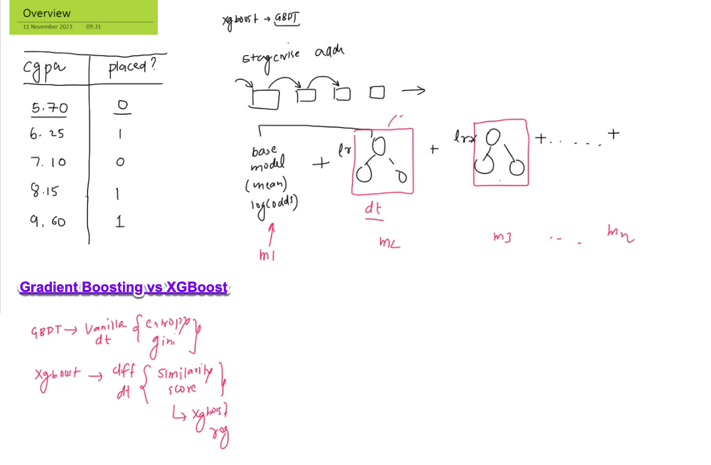

# 📖 XGBoost for Classification — Beginner-Friendly Study Guide

---

## 1. Introduction

In this tutorial, we will learn how **XGBoost** (short for **Extreme Gradient Boosting**) can be applied to **classification problems**.

- XGBoost is an optimized version of **Gradient Boosting**.
- It improves both the **performance** and **speed** of the model.
- In this guide, we will focus only on the **fundamentals** — no advanced optimization tricks yet.

---

## 2. Prerequisites

Before diving deep:
- ✅ You should know **how Gradient Boosting works** (especially for classification).
- ✅ You should know **log-odds** concept (used in Logistic Regression or Boosting).

---

## 3. Dataset Overview

We will use a **small toy dataset**:

| CGPA  | Placed? (0 = No, 1 = Yes) |
|:-----:|:-------------------------:|
| 5.70  | 0                         |
| 6.25  | 1                         |
| 7.10  | 0                         |
| 8.15  | 1                         |
| 9.60  | 1                         |

🔵 **Features**:
- `CGPA` (numerical input)

🔵 **Label**:
- `Placed?` (binary output: 0 = Not Placed, 1 = Placed)

---

## 4. How XGBoost Solves Classification

### 📈 Big Idea:
XGBoost builds the model **stage-by-stage**, **gradually correcting mistakes** from the previous stage.

The flow is:

- **Base model** (starts with log(odds) instead of mean)
- **Add Tree 1** scaled by **learning rate**
- **Add Tree 2** scaled by **learning rate**
- **Add Tree 3**, and so on...

Each tree tries to fix the **errors made so far**.

---

### 🖼️ Stagewise Additive Boosting in XGBoost:

<figure>
  
  <figcaption><b>Fig 1:</b> Stagewise Additive Boosting in XGBoost</figcaption>
</figure>

- The **base model** uses **log(odds)**.
- Each **tree** (drawn in red boxes) is multiplied by **lr** (learning rate).
- Trees are added one-by-one to improve predictions.

---

## 5. 📦 Important Concept: Learning Rate (η)

### 🔥 What is Learning Rate?

- **Learning Rate** is a small number (like 0.01 or 0.1) that **controls how much each tree's output is used**.
- It **slows down** the learning process, preventing **overfitting**.

### 🧠 Why Use Learning Rate?

- Without it, the model would jump quickly to wrong conclusions (overfitting).
- With it, the model carefully improves step-by-step.

### 🛠️ How It's Applied?

\[
\text{New Prediction} = \text{Old Prediction} + \eta \times (\text{Tree Output})
\]

Where:
- \( \eta \) is the learning rate.
- Tree Output = Prediction from the current tree.

---

### 🎯 One-line takeaway:
> **Learning rate helps XGBoost “boost carefully,” avoiding overfitting by scaling down each tree’s contribution.**

---

## 6. 🆚 Gradient Boosting vs XGBoost

<figure>
  
  <figcaption><b>Fig 2:</b> Gradient Boosting vs XGBoost</figcaption>
</figure>

### 💡 Key Differences:

| Aspect                        | GBPT (Vanilla Gradient Boosting)                 | XGBoost (Extreme Gradient Boosting)           |
|:-------------------------------|:-------------------------------------------------|:-----------------------------------------------|
| Tree Type                     | Normal Decision Trees (Entropy/Gini based splits) | Specialized Trees (Similarity Score based splits) |
| Split Criterion               | Entropy or Gini Index                            | Similarity Score optimized for speed and regularization |
| Regularization                | Basic or none                                    | Built-in L1/L2 regularization |
| Speed                          | Moderate                                         | Faster (optimized with sparsity tricks) |

---

### ✏️ Explanation:

- **GBPT** builds "vanilla" decision trees — splits based on maximizing information gain (entropy/gini).
- **XGBoost** builds trees **differently**:
  - Instead of entropy/gini, it uses a **similarity score**.
  - **Similarity score** measures how well a split reduces errors **plus regularization penalty**.
  - This makes XGBoost **faster**, **more regularized**, and **more robust**.

---

